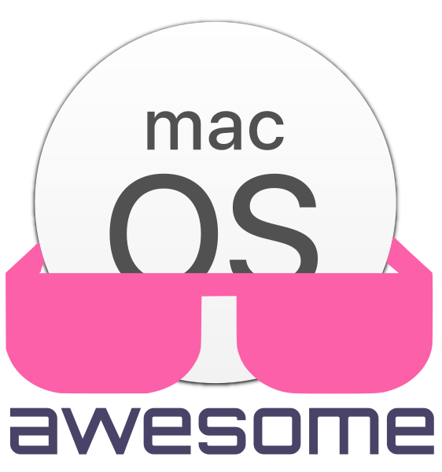

        
        <h1>AWESOME migrate Windows to MacOS</h1>
        

        Seznam utilit a aplikací, které usnadní přechod z Windows na MacOS a nejen to.
        

        Postupně budu doplňovat dle jednotlivých sekcí.

- [SYSTÉMOVÉ UTILITY](#systémové-utility)
- [DEV NÁSTROJE](#dev-nástroje)
- [PRODUKTIVITA](#produktivita)
- [HACK MacOS](#hack-macos)
- [PRÁCE](#práce)
- [ZABEZPEČENÍ](#zabezpečení)
- [SÍŤOVÉ NÁSTROJE](#síťové-nástroje)
- [VIRTUALIZACE](#virtualizace)

## SYSTÉMOVÉ UTILITY
   - [BetterTouchTool](https://folivora.ai/ "Test") - Nastavení/úprava chování vstupních zařízení pro aplikace. Například jde přemapovat chování gest na trackpadu pro různé aplikace.
   - [One Switch](https://fireball.studio/oneswitch) - Přepínače a další přepínače. Jinak to usnadní přístup ke spoustě věcem, které se musí hledat složitě po nastaveních.
   - [Bartender 4](https://www.macbartender.com/) - úprava zobrazení ikon v menu baru (ikony vedle hodin)
   - [Boom 3D](https://www.globaldelight.com/boom/) - ovládání zvuku, equalizer a další nastavení zvuku
   - [SoundSource](https://rogueamoeba.com/soundsource/) - podobné jako Boom 3D, za mě asi lépe zpracované
   - [Audio Hijack](https://rogueamoeba.com/audiohijack/) - asi nejchytřejší nahrávání jakéhokoliv zvuku v MACu
   - [CleanMyMac X](https://macpaw.com/cleanmymac) - sada nástrojů pro úklid MACu
   - [Disk Drill](https://www.cleverfiles.com/) - data recovery
   - [iStat Menus](https://bjango.com/mac/istatmenus/) - monitoring prakticky všeho co je potřeba, navíc z menu baru
   - [OpenIn](https://loshadki.app/openin/) - kontrola nad tím, co se má stát při klinutí na odkaz/soubor. Je to taková automatická nabídka, která nabídne menu možností v čem danou věc otevřít.
   - [Paletro](https://appmakes.io/paletro) - přístup ke všem funkcím v právě "focusnuté" aplikaci
   - [Quit All](https://amicoapps.com/app/quit-all/) - zavření všech aplikací najedou (dle výběru)
   - [Keka](https://www.keka.io/en/) - archivační utilita, lepšé jsem zatím nenašel
   - [AltTab](https://alt-tab-macos.netlify.app/) - Windows alt-tab na MACu
   - [Amphetamine](https://apps.apple.com/us/app/amphetamine/id937984704?mt=12) - Zabránění upsávání MACu
   - [DaisyDisk](https://daisydiskapp.com/) - kontrola obsazení disku a zobrazení velikosti položek na disku
   - [DisplayLink Manager](https://www.synaptics.com/products/displaylink-graphics/downloads/macos) - ovladač a software pro podporu připojení více než jednoho monitoru na MACu M1. Já mám takto připojený dva externí monitory - jeden 4K a jeden 2K. Takže s integrovaným displejem mám tři monitory :-)
   - [Dropover](https://dropoverapp.com/) - jednoduší přetahování souborů pomocí drag&drop.
   - [EasyRes](http://easyresapp.com/) - rychlé přepínání zobrazení. Umožňuje přepnutí i na non-retina rozlišení.
   - [iTerm](https://iterm2.com/) - nejlepší terminál pro MAC
   - [Magnet](https://apps.apple.com/cz/app/magnet/id441258766?l=cs&mt=12) - správa rozložení oken pomocí přichytávání ke hraně plochy
   - [Wineskin Winery](https://sourceforge.net/projects/wineskin/) - umožňuje konvert aplikace x86 (.exe) pro MAC
   - [Silicon](https://github.com/DigiDNA/Silicon) - Kontrola nainstalovaných aplikací zda podporují Apple Silicon nebo jen Intel čipy a jsou tudíž překládány pomocí Rosetty
   - [Maccy](https://maccy.app/) - výborný clipboard manažer, který neukládá data z předem definovaných aplikací, ukládá i obrázky.
   - [iBoysoft MagicMenu - Right Click Enhancer](https://iboysoft.com/magic-menu/) - rozšíření, které dovoluje vytvořit soubory dle přípony (můžete si přidat jaké chcete) a také urychlení přístupu do zvolených složek (opět dle definice uživatele)
   - [CopyLess2](https://copyless.net/) - clipboard manažer, lze nastavit podobně jako manager na Windows. Například na Control+Command+V zobrazit, při klikutí instantně pastenout a poté opět minimalizovat okno.
   - [uBar](https://brawersoftware.com/products/ubar) - náhražka DOCKU, podporuje preview windows u jednotlivých programů, umí se různě PINovat atd.

## DEV NÁSTROJE
   - [VSCode](https://code.visualstudio.com/) - za mě nejlepší textový editor. Pokud si ho člověk vymazlí, tak se z něj dá udělat prakticky IDE
   - [Postman](https://www.postman.com/) - testování API (alternativa k Postmanu je třeba Insomnia nebo plugin pro VSCode Thunder Client)
   - [Dash](https://kapeli.com/dash) - offline docsety pro různé jazyky. Hodí se pro lidi, kteří dělají v terénu a nemají třeba stálý přístup k intrnetu.
   - [DevUtils](https://devutils.app/) - sada nástrojů pro vývojáře. Spousta těch věcí jde vyřešit například přes konzole v prohlížečích nebo pomocí pluginů v editorech/IDE, ale proč to nemít na jednom místě.
   - [Expressions](https://www.apptorium.com/expressions) - [App Store](https://apps.apple.com/us/app/expressions/id913158085?mt=12) - aplikace určená pro testování a práci s regexem
   - [SnippetsLab](https://www.renfei.org/snippets-lab/) - systém pro ukládání útržků kódu a textů
   - [Webp Converter - AnyWebP]() - Převod formátů JPG/PNG do Webp a zpět

## PRODUKTIVITA
   - [Workspaces](https://www.apptorium.com/workspaces) - neskutečné zrychlení práce díky nadefinování pracovního prostoru, který po aktivaci otevře zvolené programy, složky, webové stránky, multimédia atpd. Výborné pro lidi, kteří mají svůj stack aplikací, které pravidělně používá. Stačí nadefinovat co se má otevírat a naříklad po restartu stačí spustit jen jedním kliknutím daný workspace.

## HACK MacOS

## PRÁCE

## ZABEZPEČENÍ
   - [1Password](https://1password.com/) - multiplatformní nástroj pro správu hesel. Za mě asi jeden z nejlpších, ale placený, což může být pro někoho výhoda.
   - [WireGuard](https://www.wireguard.com/) - nástroj pro šifrovanou komunikaci - tunely VPN
   - [Cryptomator](https://cryptomator.org/) - výborný nástroj, který dokáže šifrovat kontejnery přímo v cloudu. Navíc zdarma
   - [Authy](https://authy.com/) - pro lidi používající 2FA jedna z nejlepších voleb, protože má online zálohy a má i mobilní aplikace jak pro iOS, tak i pro Android
   - [VeraCrypt](https://www.veracrypt.fr/code/VeraCrypt/about/) - šifrování disků, souborů a vytváření skrytých kontejnerů

## SÍŤOVÉ NÁSTROJE
   - [Wireshark](https://www.wireshark.org/) - asi jeden z nejlepších programů pro analyzovaní provozu sítě
   - [Zenmap](https://nmap.org/zenmap/) - výborný nástroj na skenování (penetrační testy) sítí, pomocí kterého dokážete získat o cíly mraky informací z jednoho místa. Troufám si tvrdit, že je to jeden z nejpoužívanějších nástrojů tohoto typu.
   - [Angry IP Scanner](https://angryip.org/) - pokud potřebujete jednoduše zjistit připojené zažízení na síti, ke které jste připojení, není jednodušší cesta.
   - [WiFi Explorer](https://www.intuitibits.com/) - další nástroj pro analýzu WiFi a příadných problémů s pokrytím
   - [NetSpot](https://www.netspotapp.com/) - hodně slušný nástroj na analýzu pokrytí WiFi sítí a problémy s kvalitou a rychlostí.

## VIRTUALIZACE
   - [UTM](https://mac.getutm.app/) - Nástroj pro vytváření virtualizovaných OS zdarma (alternativa k Parallelsu) - [GithHub](https://github.com/utmapp/UTM/releases).
   - [Parallels® Desktop](https://www.parallels.com/eu/products/desktop/) - Výborný nástroj pro emulaci OS na Apple M1. Tento nástroj je zpoplatněný.
